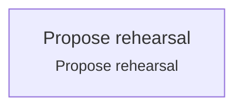

# Polls & proposals

[← Screen map](README.md) · profile phone-portrait

## member (1 screens)

_Leo M. as a member of Velvet Static (not admin)_ · source: [polls.member.mmd](polls.member.mmd)

```mermaid
flowchart LR
  s0["Propose rehearsal<br/><small>Propose rehearsal</small>"]
  classDef root stroke-width:3px
  classDef flagged stroke:#d33,stroke-width:2px
  classDef stub fill:none,stroke-dasharray: 3 3
```
